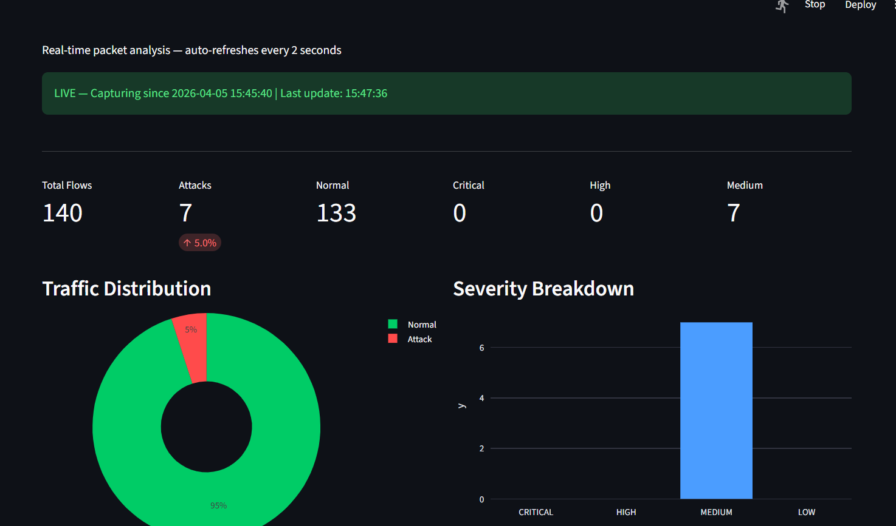
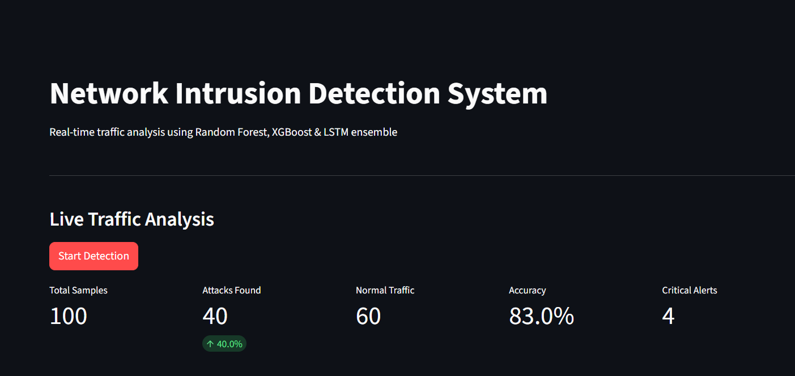
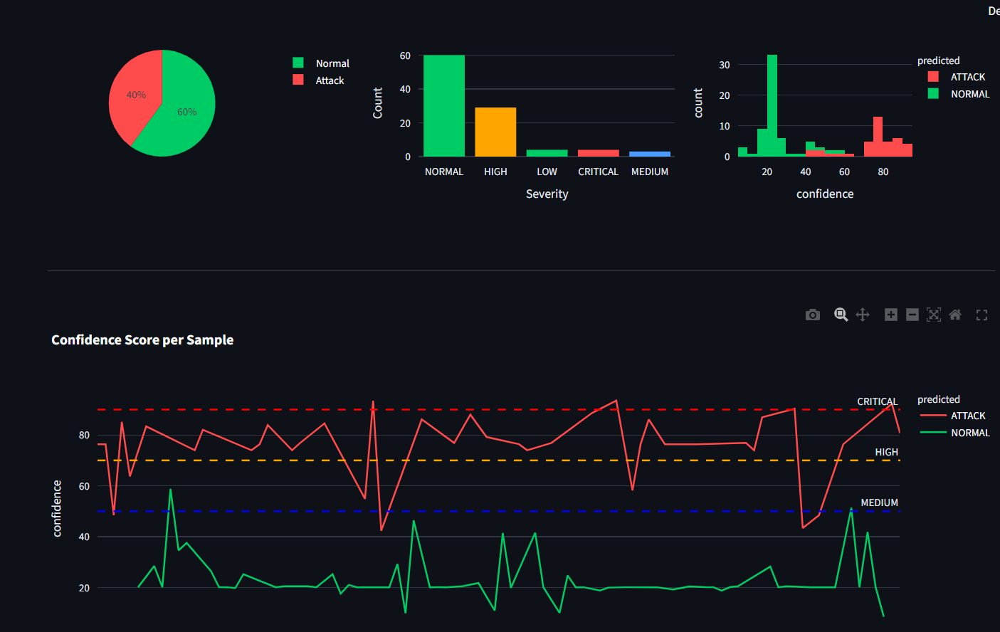
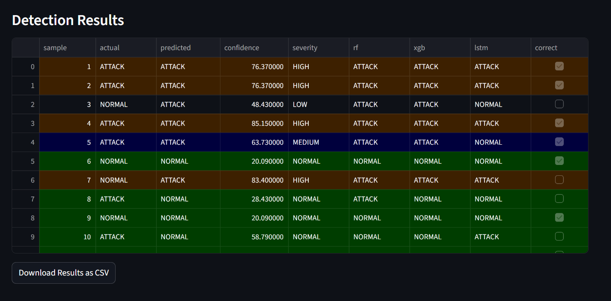
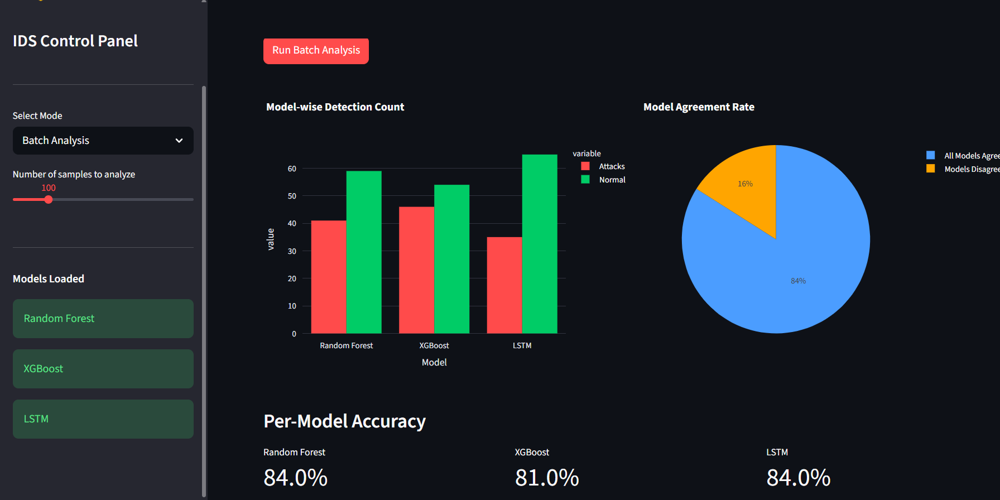

# Network Intrusion Detection System (IDS)

A machine learning-based Network Intrusion Detection System trained on the **NSL-KDD dataset** using an ensemble of Random Forest, XGBoost, and LSTM models with a **real-time live packet capture dashboard** powered by Scapy and Streamlit.

---

## Dashboard Preview

### Live Network Capture Dashboard


### Main Dashboard


### Traffic Charts


### Detection Results Table


### Batch Model Comparison


---

## Features

- **3-Model Ensemble** — Random Forest + XGBoost + LSTM majority voting
- **Real-time Live Capture** — Captures actual network packets using Scapy + Npcap
- **Full NSL-KDD Feature Engineering** — All 41 features extracted from live connection flows
- **Connection Flow Tracking** — TCP state machine, byte accumulation, sliding window rate features
- **Severity Levels** — CRITICAL / HIGH / MEDIUM / LOW based on ensemble confidence score
- **Live Dashboard** — Auto-refreshing charts, KPI metrics, confidence timeline
- **Batch Analysis** — Compare all 3 models side by side
- **Alert Logging** — JSON structured logs saved to `logs/ids_alerts.log`
- **CSV Export** — Download detection results with one click
- **NSL-KDD Dataset** — Industry standard benchmark, superior to KDD Cup 99

---

## Project Structure

```
network-ids/
│
├── data/                              # NSL-KDD dataset files (download separately)
│   ├── KDDTrain+.txt                  # 125,973 training samples
│   ├── KDDTest+.txt                   # 22,544 test samples
│   ├── KDDTrain+_20Percent.txt
│   └── KDDTest-21.txt
│
├── models/                            # Saved trained models (generated by train.py)
│   ├── rf_model.pkl                   # Trained Random Forest
│   ├── xgb_model.pkl                  # Trained XGBoost
│   ├── lstm_model.keras               # Trained LSTM (TensorFlow)
│   └── scaler.pkl                     # StandardScaler
│
├── src/
│   ├── preprocess.py                  # Data loading, encoding, scaling
│   ├── train.py                       # Model training & evaluation
│   ├── predict.py                     # Inference engine (single + batch)
│   ├── alert_engine.py                # Alert generation & severity logging
│   ├── dashboard.py                   # Streamlit batch analysis dashboard
│   ├── live_capture.py                # Real-time packet capture (Scapy + Npcap)
│   └── live_dashboard.py              # Live auto-refreshing dashboard
│
├── logs/
│   └── ids_alerts.log                 # JSON structured alert logs
│
├── screenshots/                       # Dashboard screenshots
├── notebooks/
│   └── eda.ipynb                      # Exploratory data analysis
│
├── requirements.txt
├── .gitignore
└── README.md
```

---

## Model Performance

| Model | Accuracy | F1 Score | Attack Recall |
|---|---|---|---|
| Random Forest | 77.17% | 76.86% | 62% |
| XGBoost | 80.56% | 80.46% | 68% |
| LSTM | 78.23% | 78.01% | 64% |
| **Ensemble (Majority Vote)** | **81.0%** | **80.5%** | **70%** |

> Note: Lower test accuracy compared to training is expected on NSL-KDD — the test set contains novel attack types not present in training data, making it a realistic evaluation benchmark.

---

## Dataset

**NSL-KDD** — An improved version of the KDD Cup 1999 dataset.

| File | Samples | Description |
|---|---|---|
| KDDTrain+ | 125,973 | Full training set |
| KDDTest+ | 22,544 | Full test set (includes novel attacks) |

- **41 features** covering network connection properties
- **Binary classification**: Normal (0) vs Attack (1)
- **Attack categories**: DoS, Probe, R2L, U2R

---

## Tech Stack

| Component | Technology |
|---|---|
| Language | Python 3.10+ |
| ML Models | scikit-learn, XGBoost, TensorFlow/Keras |
| Live Packet Capture | Scapy, Npcap (Windows) |
| Dashboard | Streamlit, Plotly |
| Data | pandas, numpy |
| System Monitoring | psutil |
| Logging | Python logging (JSON format) |

---

## Installation

### 1. Clone the repository

```bash
git clone https://github.com/Surisetti-4002/network-ids.git
cd network-ids
```

### 2. Create virtual environment

```bash
python -m venv venv

# Windows
venv\Scripts\activate

# Linux/Mac
source venv/bin/activate
```

### 3. Install dependencies

```bash
pip install -r requirements.txt
```

### 4. Install Npcap (Windows only — required for live capture)

Download and install from: https://npcap.com/#download

### 5. Download NSL-KDD dataset

Download from [Kaggle NSL-KDD](https://www.kaggle.com/datasets/hassan06/nslkdd) and place files in `data/` folder:

```
data/
├── KDDTrain+.txt
├── KDDTest+.txt
├── KDDTrain+_20Percent.txt
└── KDDTest-21.txt
```

---

## Usage

### Step 1 — Preprocess data

```bash
python src/preprocess.py
```

### Step 2 — Train all models

```bash
python src/train.py
```

### Step 3 — Test predictions

```bash
python src/predict.py
```

### Step 4 — Run alert engine

```bash
python src/alert_engine.py
```

### Step 5 — Launch batch dashboard

```bash
streamlit run src/dashboard.py
```

### Step 6 — Launch live capture + dashboard

Open **two terminals**:

**Terminal 1 — Run as Administrator (packet capture)**
```bash
python src/live_capture.py
# Select your Wi-Fi interface
# Runs continuously until Ctrl+C
```

**Terminal 2 — Live dashboard**
```bash
streamlit run src/live_dashboard.py
```

Open browser at `http://localhost:8501` and browse the web to generate traffic!

---

## How It Works

### Preprocessing Pipeline
1. Load NSL-KDD with 43 column names
2. Drop difficulty column
3. Label encode categorical features (`protocol_type`, `service`, `flag`)
4. Binary encode labels (0=Normal, 1=Attack)
5. StandardScaler normalization → save `scaler.pkl`

### Ensemble Prediction
Each traffic sample is passed through all 3 models independently. The final prediction uses **majority voting** — if 2 or more models agree on ATTACK, the sample is flagged.

### Live Feature Engineering
Real network packets are captured using Scapy and converted into all 41 NSL-KDD features:

| Feature Group | How Extracted |
|---|---|
| `duration` | End time − start time of full TCP connection |
| `src_bytes / dst_bytes` | Accumulated from both directions of flow |
| `flag` | Decoded from full TCP handshake (SYN/FIN/RST) |
| `wrong_fragment` | Counted from IP fragment flags |
| `urgent` | Counted from TCP urgent pointer |
| `land` | Checked if src IP == dst IP |
| `count / srv_count` | 2-second sliding window of connections |
| `serror_rate` | Ratio of SYN-error connections in window |
| `dst_host_*` | Last 100 connections to same destination host |

### Severity Scoring

| Confidence | Severity |
|---|---|
| >= 90% | CRITICAL |
| >= 70% | HIGH |
| >= 50% | MEDIUM |
| < 50% | LOW |

---

## Author

**Surisetti Manoj Akash**  
B.Tech — Cyber Security  
[LinkedIn](https://www.linkedin.com/in/manoj-akash-surisetti-616a032b9/) | [GitHub](https://github.com/Surisetti-4002)

---

## References

- Tavallaee, M., Bagheri, E., Lu, W., & Ghorbani, A. A. (2009). *A detailed analysis of the KDD CUP 99 data set*. CISDA 2009.
- NSL-KDD Dataset — Canadian Institute for Cybersecurity, University of New Brunswick
